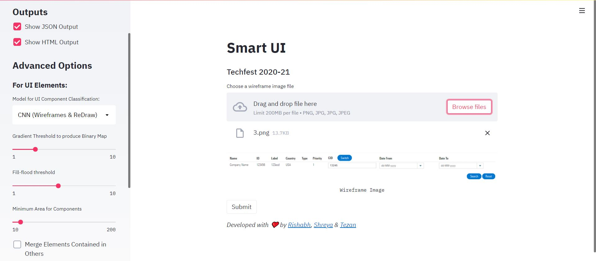

# Smart UI (Techfest 2020-21)

## Problem Statement

Generate a JSON file (`output.json`) from the screenshot of the wireframe. The file should contain the details of various elements used in the webpage.

[Link to Detailed Problem Statement](assets/pdf/SmartUI.pdf)

---

## Our Solution



### Description: [TODO]

### Usage: [TODO]

```bash
# Setup
$ git clone https://github.com/tezansahu/smart_ui_tf20.git
$ cd smart_ui_tf20/app
$ pip install -r requirements.txt

# Start the app
$ streamlit run app.py
```

This should start the app on `localhost` & fire up a tab in the browser

---

## Deep Learning Models

The following DL Models (CNNs) have been developed as a part of this project for categorize detected UI components into specific classes:

1. __CNN Trained on RICO Dataset__ _(Pretrained & used in UIED)_
2. __CNN Trained on Wireframes Dataset (provided by organizers)__ _(Transfer Learning using Model 1 as Base Model)_
3. __CNN Trained on Generalized Dataset (Wireframes + ReDraw Dataset)__ _(Transfer Learning using Model 2 as Base Model)_

Details about the models, inculding their training, performance & downloadable weights can be found [here](./models/README.md).


---

<p align="center">Created with ❤️ by <a href="https://rishabharya.site/" target="_blank">Rishabh</a>, <a href="https://laddhashreya2000.github.io" target="_blank">Shreya</a> & <a href="https://tezansahu.github.io/" target="_blank">Tezan Sahu</a></p>