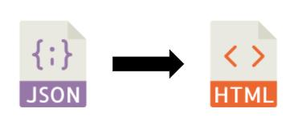

# HTML Code Generator [TODO - Rishabh] 

<!-- [Write the overview about parsing the JSON & creating tags based on the `element` for each component. Mention about absolute positioning of the elements on the screen. Talk about adding styles as well using the `properties`. Do mention about `yattag` being used.] -->

- Passed the generated output JSON file to convert it into a HTML string using [`yattag`](https://www.yattag.org/) _(`yattag` is a python library to generate HTML in a pythonic way)_

- Maintained a mapping to convert extracted elements name into valid html tags.

- Used `yattag` to create tags based on the `element` for every component. Used `position:fixed` style in every tag for absolute positioning of the elements on the screen.

- Added style attribute for every component using the `properties`.
