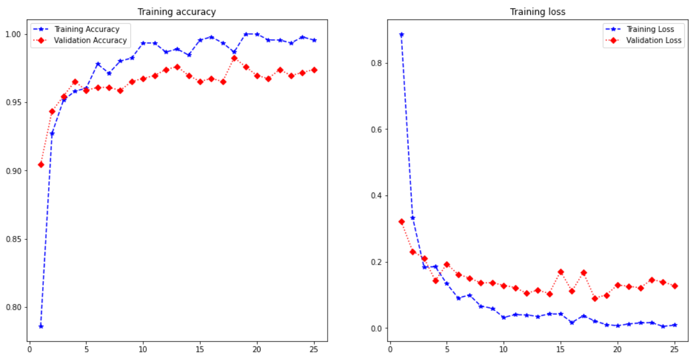
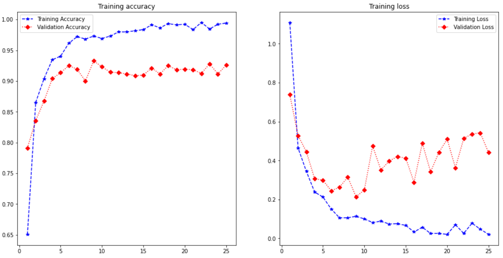

# Deep Learning Models for UI Component Classification

Following are the weights for the CNN Models that have been developed as a part of this project:

- CNN Trained on RICO Dataset: [`cnn-rico-1.h5`](https://drive.google.com/file/d/1Gzpi-V_Sj7SSFQMNzy6bcgkEwaZBhGWS/view?usp=sharing)
- CNN Trained on Wireframes Dataset (provided by organizers): [`cnn-wireframes-only.h5`](https://drive.google.com/file/d/1eUqku9yAZ8MfxCS5FxlsagZmcP1PN-JU/view?usp=sharing)
- CNN Trained on Generalized Dataset (wireframes + ReDraw Dataset): [`cnn-generalized.h5`](https://drive.google.com/file/d/1XPw_hhm_ZwhD-_TppMXgCbOe3XTr641u/view?usp=sharing)

_**Note:** To run the app (present in the `app/` directory), we need to download the required CNNs mentioned above_ 

## CNN Trained on RICO Dataset

This is a pre-trained CNN, used in [UIED]() for component classification. It can classify UI elements into the following classes:

- Button
- CheckBox
- Chronometer
- EditText
- ImageButton
- ImageView
- ProgressBar
- RadioButton
- RatingBar
- SeekBar
- Spinner
- Switch
- ToggleButton
- VideoView
- TextView

_**Note:** Since this model was trained purely on RICO Dataset, it does not perform very well in classifying the elements in the Wireframes provided by the organizers_

## CNN Trained on Wireframes Dataset

This CNN Model has been trained using Transfer Learning, with `cnn-rico-1.h5` as the base model, on the snipped components obtained from the Wireframes dataset provided by the organizers. It can classify UI elements into the following 14 classes:

- div
    - rectangular
    - rounded
- text
- checkbox
- radio button
- icons
    - down-arrow
    - left-arrow
    - right-arrow
    - triangle-down
    - triangle-up
    - dash
    - left-double-arrow
    - right-double-arrow
- scroll bar

The entire training can be found in [this notebook](./ComponentClassificationModel_WireframesOnly.ipynb). We achieve a test accuracy of ~96%. The plot for the performance of the model over training period is presented below:

## CNN Trained on Generalized Dataset

This CNN Model has been trained using Transfer Learning, with `cnn-wireframes-only.h5` as the base model, on the snipped components obtained from the ReDraw Dataset as well as the Wireframes dataset provided by the organizers. It can classify UI elements into the following 13 classes:

- div
    - rectangular
    - rounded
- text
- checkbox
- radio button
- icons
    - down-arrow
    - left-arrow
    - right-arrow
    - up-arrow
    - dash
- scroll bar
- toggle switch
- image

The entire training can be found in [this notebook](./ComponentClassificationModel_Wireframes&ReDraw.ipynb). We achieve a test accuracy of ~92%. The plot for the performance of the model over training period is presented below:

